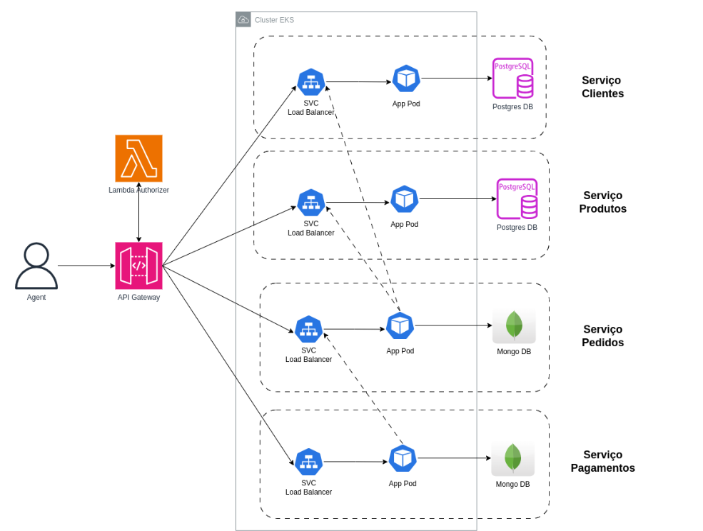

# tech-challenge-fiap
Sistema de Gerenciamento de Pedidos - Fast Food

##  Grupo 33
[Wellington da Silva Alencar](https://github.com/wellalencarweb) | rm353081

# FASE 4 - ARQUITETURA DE MICROSERVIÇOS

## Arquitetura
Os diagramas que se seguem demonstram de forma macro, os fluxos de:
- [repositórios gerais](#ancora1)
- [arquitetura da fase 04](#ancora2)

## Repositórios Gerais

**[authorization-validator-lambda](https://github.com/wellalencarweb/authorization-validator-lambda)**: Ambiente serverless que engloba a implementação da rota para a geração de tokens de usuário, uma função lambda para autorização e a configuração do API Gateway.

**[k8s-cluster-infra](https://github.com/wellalencarweb/authorization-validator-lambda)**: Gerenciar a infraestrutura do cluster Kubernetes do projeto.

**[sonarqube-infra](https://github.com/wellalencarweb/authorization-validator-lambda)**: Gerenciar uma máquina EC2 para hospedar o SonarQube.

## Arquitetura Fase 04

A aplicação desenvolvida nas fases anteriores foi dividida em 4 serviços independentes, conforme ilustrado no diagrama abaixo. As setas pontilhadas entre os Pods e SVCs indicam que há comunicação (via requisições HTTP) entre os serviços.

#### Pagamentos

- **[app-pagamentos](https://github.com/wellalencarweb/app-pagamentos)**: Aplicação do serviço desenvolvida em Node.js para gerenciar informações e operações relacionadas a pagamentos.
- **[mongo-pagamentos-infra](https://github.com/wellalencarweb/mongo-pagamentos-infra)**: Gerenciar a infraestrutura do banco de dados MongoDB utilizado pelo serviço de pagamentos.
- **[k8s-pagamentos-infra](https://github.com/wellalencarweb/k8s-pagamentos-infra)**: Gerenciar os recursos de Kubernetes específicos para o serviço de pagamentos.

#### Pedidos

- **[app-pedidos](https://github.com/wellalencarweb/app-pedidos)**: Aplicação do serviço desenvolvida em Node.js para gerenciar informações e operações relacionadas a pedidos.
- **[mongo-pedidos-infra](https://github.com/wellalencarweb/mongo-pedidos-infra)**: Gerenciar a infraestrutura do banco de dados MongoDB utilizado pelo serviço de pedidos.
- **[k8s-pedidos-infra](https://github.com/wellalencarweb/k8s-pedidos-infra)**: Gerenciar os recursos de Kubernetes específicos para o serviço de pedidos.

#### Produtos

- **[app-produtos](https://github.com/wellalencarweb/app-produtos)**: Aplicação do serviço desenvolvida em Node.js para gerenciar informações e operações relacionadas a produtos.
- **[postgres-produtos-infra](https://github.com/wellalencarweb/postgres-produtos-infra)**: Gerenciar a infraestrutura do banco de dados PostgreSQL utilizado pelo serviço de produtos.
- **[k8s-produtos-infra](https://github.com/wellalencarweb/k8s-produtos-infra)**: Gerenciar os recursos de Kubernetes específicos para o serviço de produtos.

#### Clientes

- **[app-clientes](https://github.com/wellalencarweb/app-clientes)**: Aplicação do serviço desenvolvida em Node.js para gerenciar informações e operações relacionadas a clientes.
- **[postgres-clientes-infra](https://github.com/wellalencarweb/postgres-clientes-infra)**: Gerenciar a infraestrutura do banco de dados PostgreSQL utilizado pelo serviço de clientes.
- **[k8s-clientes-infra](https://github.com/wellalencarweb/k8s-clientes-infra)**: Gerenciar os recursos de Kubernetes específicos para o serviço de clientes.

[Fase 03 - Para Consulta](https://github.com/wellalencarweb/tech-challenge-fiap-fase-03)

